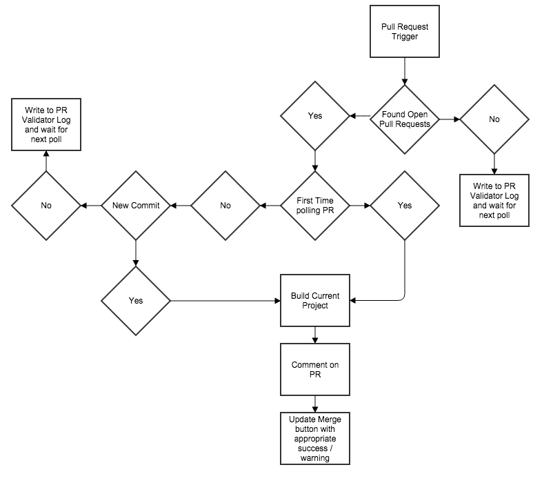
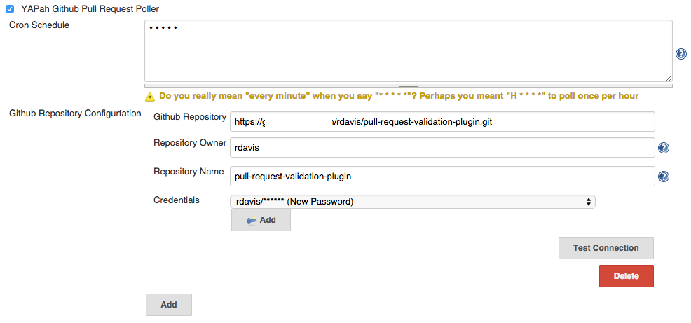
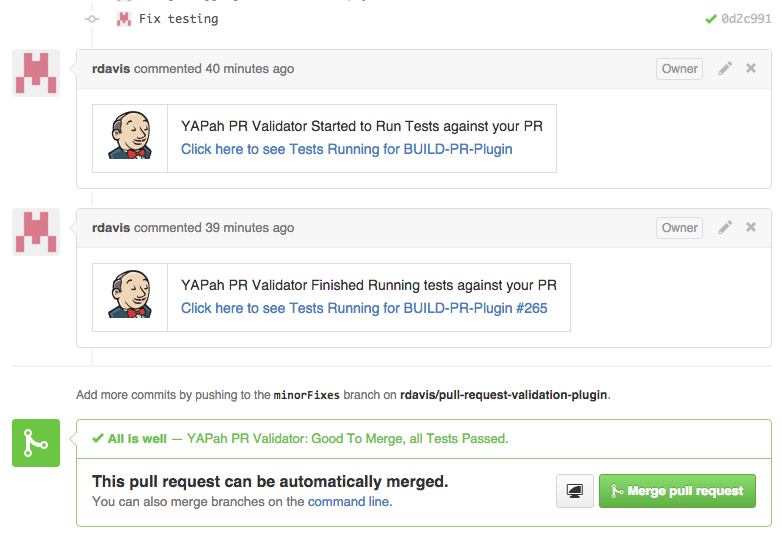

# YAPah - Yet Another Pull Request
## Jenkins Plugin
### Summary
This Jenkins plugin builds pull requests from Github and comments on the pull request when the job has started and again to let you know the status when it finished. Since this plugin starts from a trigger, it allows you to fill your jenkins jobs with various build steps to analyse, test, or anything else that another plugin can provide as a build step.  Allowing you to fail your build along the way if it did not meet all of the criteria of the job. 

#### Example Use Case
##### Code analyse with Sonar
Job is triggered from a pull request, the sonar runner plugin analyses the code and gets a code coverage percent.  If this percentage is below a company standard, the shell build script fails out.  The publisher post action will comment on the pull request saying the build has failed and to be careful to merge with a link to the build to explain why.

### Required Jenkins Plugins

* GitHub API Plugin (https://wiki.jenkins-ci.org/display/JENKINS/GitHub+API+Plugin)
* GitHub Plugin (https://wiki.jenkins-ci.org/display/JENKINS/GitHub+Plugin)
* Git Plugin (https://wiki.jenkins-ci.org/display/JENKINS/Git+Plugin)
* Credentials Plugin (https://wiki.jenkins-ci.org/display/JENKINS/Credentials+Plugin)
* Plain Credentials Plugin (https://wiki.jenkins-ci.org/display/JENKINS/Plain+Credentials+Plugin)

### Installation

1. Build the plugin (mvn package)
2. Copy YAPah.hpi from your target directory into your plugins directory
3. Restart Jenkins

### Configuration

1. Go to Manage Jenkins
2. Configure System
3. YAPah Github Pull Request Poller
4. Change github.com to any enterprise github (github.company.com)

### Build Configuration

1. Create a parameterized build
2. Create a String parameter with the name of sha and the default value of master
3. Create a String parameter with the name of gitHubHeadRepository and default it to your repository
4. Select Git as your Source Code Management
5. Enter ${gitHubHeadRepository} for the Repository URL
6. Enter ${sha} for Branches to Build
7. Select YAPah Github Pull Request Poller under Build Triggers
8. Enter a Cron Schedule to your preference (e.g. * * * * * for once a minute)
9. Enter your Github Repository
10. Enter the owners name of the repository
11. Enter the Repository Name
12. Store a user to whom has access to comment on pull requests for the repository.  Please try to use a System user as passwords tend to expire.
13. Click Test Connection to validate that everything is setup correctly.
14. Add a Post build Action and select YAPah Github API Pull Request Validator

### Flow Diagram

### Example Configuration

### Example Comments

